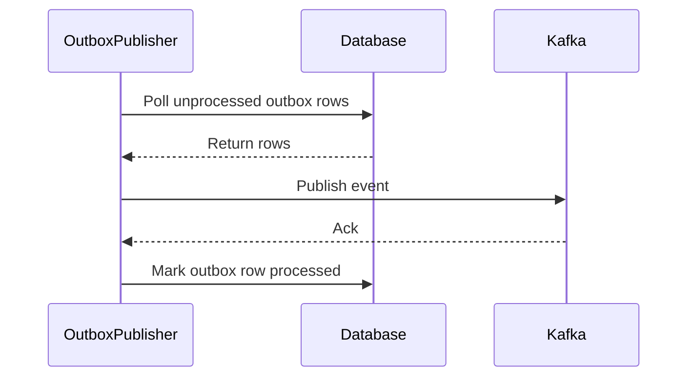

# Order Orchestration (order-orch)

## Overview

This repository contains a lightweight Order Orchestration service using the Outbox pattern and Kafka for eventual consistency. The primary service is `order_service` (Node.js / TypeScript) which handles order lifecycle, persists to a database via Prisma, and publishes domain events to Kafka via an outbox table.

## Table of Contents

- [Overview](#overview)
- [Architecture](#architecture)
- [Flowcharts](#flowcharts)
- [Quick Start](#quick-start)
- [Project Structure](#project-structure)
- [Environment Variables](#environment-variables)
- [Development Notes](#development-notes)
- [Future Services To Be Added](#future-services-to-be-added)
- [Roadmap](#roadmap)
- [Contributing](#contributing)

## Architecture

High-level components:

- `order_service`: API + business logic, implements outbox writes.
- `Prisma` + relational DB: order and outbox persistence.
- `Kafka` cluster: transport for domain events.
- `Outbox publisher`: reads outbox rows and publishes to Kafka.

**Architectural goals**: durability (DB-backed outbox), eventual consistency, resilient retry for publishing, clear separation between command handling and event publishing.

## Flowcharts

High-level order creation flow:


Outbox publisher flow (retry & ack semantics):



## Quick Start

1. Install dependencies

```bash
cd order_service
npm install
```

2. Set environment variables (see below), then run locally

```bash
npm run dev
```

3. Apply Prisma migrations

```bash
cd order_service
npx prisma migrate dev
```

## Project Structure

- `order_service/` — main service (Node.js + TypeScript)
  - `src/` — application sources
  - `prisma/` — Prisma schema & migrations
  - `package.json` — npm scripts and deps
- `prisma/` — central schema / migrations used by the repo

See `order_service/src` for service modules: `kafka/`, `modules/order/`, `outbox/`, and `prisma/prisma.ts`.

## Environment Variables

Minimum required env vars:

- `DATABASE_URL` — Prisma DB connection string
- `KAFKA_BROKERS` — comma-separated list of brokers
- `KAFKA_CLIENT_ID` — client id
- `PORT` — service HTTP port (default 3000)

Store secrets in `.env` (not committed). A sample `.env.example` would be helpful.

## Development Notes

- Uses Prisma for schema/migrations. Keep the `prisma/migrations` folder in source control.
- The outbox table should contain columns: `id`, `aggregate_id`, `type`, `payload`, `status`, `attempts`, `created_at`, `processed_at`.
- Publisher should implement idempotency and exponential backoff on retries.

## Future Services To Be Added

- **Payment Service**: handle payment capture, emit `PaymentCaptured` events.
- **Inventory Service**: reserve inventory on order creation, emit `InventoryReserved` or `InventoryFailed`.
- **Notification Service**: send email/SMS notifications for order status changes.
- **Shipping Orchestrator**: schedule shipments and track delivery status.
- **Monitoring / Metrics Service**: collect metrics and alerts for publisher failures and high retry counts.
- **Schema Registry**: manage event schemas (Avro/JSON Schema) and validation before publishing.

## Roadmap

Short term:

- Harden outbox publisher (checkpointing, batching).
- Add integration tests covering DB → outbox → Kafka.

Medium term:

- Add Payment and Inventory microservices and sample consumer implementations.
- Add CI that runs Prisma migrations and publishes contract tests for events.

Long term:

- Full observability: tracing across services, distributed tracing (OpenTelemetry).
- Multi-tenant support and schema evolution tooling.

## Contributing

1. Open an issue describing your change or feature request.
2. Create a branch `feat/your-feature` or `fix/issue-number`.
3. Run tests and linting, add migration files if DB schema changed.
4. Open a PR with a clear description and testing steps.

---

If you'd like, I can also:

- Add a runnable `docker-compose` example for Kafka + Postgres.
- Add `.env.example` and a sample `prisma` seed script.

